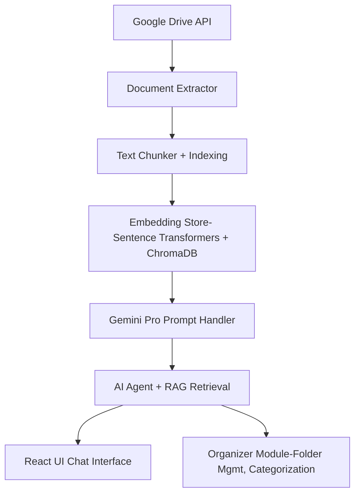

# 2025 Summer Hackathon Project

**Nonprofit**: [Heritage Square Foundation](https://thesquarephx.org/)  
**Team**: AISummerHACK  

## Team Members
- [Sangeetha Sasikumar](https://github.com/Sangeetha-007)
- [Isaac Phiri](https://github.com/IsaacPhiri)
- [Amit Raj Reddy Dharam](https://github.com/Ames-Zero)
- [Vishal Budamala](https://github.com/vbudamal12)
- [Raylene Faerber](https://github.com/rfaerber1)  

---

## Project Overview

### Problem
Heritage Square’s Google Drive was heavily cluttered and unstructured, making it difficult for team members to locate key files related to events, marketing, operations, and donor records. Staff were also relying on manual queries using Gemini AI, which introduced inefficiencies and inconsistent results.

### Solution
We developed an AI-powered Google Drive assistant to:

- Automatically categorize and organize files into meaningful folders  
- Use Google’s Gemini API to understand content and respond to natural language prompts  
- Provide a user-friendly React chat interface for interacting with the assistant  
- Enable scalable document search using embeddings and vector databases  
- Offer cleanup utilities like removing empty folders and merging duplicates  

---

## Project Goal

Empower Heritage Square’s team with a smart, integrated assistant that:

- Organizes Drive content using classification and dynamic folder creation  
- Enhances productivity through natural language document search  
- Supports scalable document management and knowledge access  
- Saves time and reduces reliance on manual processes  

---

## Tech Stack

| Layer               | Technologies Used                                                                 |
|---------------------|-----------------------------------------------------------------------------------|
| **Frontend**        | React.js + Vite                                                                  |
| **Backend**         | FastAPI (Python), Uvicorn                                                        |
| **AI Integration**  | Gemini Pro via `google.generativeai` + Gemini Vision                             |
| **Embedding & RAG** | LangChain(Huggingface embeddings), ChromaDB, PDF/DOCX text extraction                                       |
| **File Categorization** | Custom LLM prompts, dynamic folder matching                                |
| **APIs**            | Google Drive API                                                                 |
| **Deployment**      | *(Pending full functionality due to service account limitations)*               |

---

## High-Level Architecture



---

## File Structure

```bash
backend/
├── main.py                # Entry point for backend server
├── .env                  # Environment variables
├── requirements.txt      # Python dependencies
│
├── config/               # Configuration files (settings, credentials)
│
├── tests/ 
├── api/                  # API route handlers for organizing and querying
│
├── modules/              # Core logic modules for organization and AI agent
│   ├── organizer/        # Module 1: Google Drive organization + Knowledge Graph
        ├── README.md
        ├── __init__.py
        ├── categorization.py
        ├── categorizer.py
        ├── drive_auth.py
        ├── drive_files.py
        ├── file_utils.py
        ├── folder_utils.py
        ├── genai_client.py
        ├── upload_file.py
│   ├── ai_agent/         # Module 2: AI agent with RAG-based querying
│   ├── vector_store/     # Embedding and semantic search components
│   ├── knowledge_graph/  # Shared knowledge graph utilities and storage
│
├── shared/               # Common utilities, schemas, prompts
│
├── frontend/frontend-app
├── tests/                # Unit and integration tests
```


---

## Running the Project Locally
### Prerequisites
- Python 3.10+
- Node.js (v18+)
- credentials.json for OAuth Drive access (manual only)
- Enable Drive API and Gemini API on GCP

### 🔐 Authentication with Google Drive (OAuth 2.0)

To enable access to Google Drive for organizing and categorizing files, the organizer module uses **OAuth 2.0** authentication. During setup, a `token.json` file is generated to store the access and refresh tokens for future authenticated requests.

#### How `token.json` is generated:

1. Ensure you have a valid `credentials.json` file downloaded from your [Google Cloud Console](https://console.cloud.google.com/apis/credentials) with **OAuth client credentials**.
2. When the API (`uvicorn main:app --reload`) is run for the first time:

   * A browser window will open prompting you to sign in and authorize the app to access your Google Drive.
   * Upon successful authorization, a file named `token.json` will be automatically created in the project directory.
3. This `token.json` contains:

   * The access token (short-lived)
   * The refresh token (used to obtain new access tokens automatically)

#### Notes:

* You **must** share the Google Drive with the email listed in your `credentials.json` to allow access.
* The `token.json` file is reused in subsequent runs, so you won’t need to authorize again unless it expires or is deleted.
* For production, consider securing or regenerating `token.json` per user, or switching to a **service account** with shared Drive access (though with limited functionality).

### Backend
```bash
git clone https://github.com/2025-Arizona-Opportunity-Hack-Summer/AISummerHACK-HeritageSquareFounda
cd backend
pip install -r requirements.txt
uvicorn main:app --reload
```
### Frontend
```bash
cd frontend/frontend-app
npm install
npm run dev
```

---
## Deployment Notes

- The organizer module (folder cleanup, categorization) works perfectly in development using a credentials.json file for OAuth authentication.
- In production, Google service accounts are preferred, however, they don’t have full access rights to user Drive contents unless each folder is manually shared.
- For now, only the prompt feature works in production using service accounts.
- Categorization and cleanup require OAuth flow for full access.
- This limitation blocks full deployment but still allows demoing the AI agent’s core prompt capabilities.

---

## Known Challenges & Fixes

### Major Wins:
- Cleaned and standardized API JSON responses
- Successfully authenticated Drive API for downloads and file movements
- Integrated Gemini Pro (text + image) for intelligent classification


### Challenges:
- Service accounts lack write permissions to shared drives unless folders are manually shared

- Some error messages were returned as AI responses, this has been flagged

- Categorization accuracy needs improvement (especially on mixed content files)


---

## Demo Video

link : https://youtu.be/-Hqu7ILFeAU

---

## Documentation

- Main README.md (you’re here)

- Module-specific READMEs in /modules

- .env.template provided for backend setup

---

## DevPost Submission

- DevPost Project Link: https://devpost.com/software/heritage-square-foundation

---

## Team Challenges

- Coordinating across 4 time zones
- Limited real-time availability for meetings
- Adapting to LangChain, Google Drive APIs, and Gemini integration
- Managing merge conflicts and last-minute deployment issues
- Power outages and connectivity problems during final stages


---

## Inspiration & Team Culture

- Despite technical hurdles, power outages, and time constraints, the team remained committed, collaborative, and encouraging. We embraced the value of:
> “Take your time, but remember the timeline.”

- We didn’t just build an app — we built a tool that empowers the people who serve their community.

---

## Contact

- [Team Slack Channel](https://opportunity-hack.slack.com/app_redirect?channel=aisummerhack)
- GitHub: https://github.com/2025-Arizona-Opportunity-Hack-Summer/AISummerHACK-HeritageSquareFounda
- Nonprofit: Heritage Square Foundation

## Quick Links
- Nonprofit: [Heritage Square Foundation](https://ohack.dev/nonprofit/QFPGmii2GmDPYrv5tjHA)
- [Hackathon Details](https://www.ohack.dev/hack/2025_summer)


